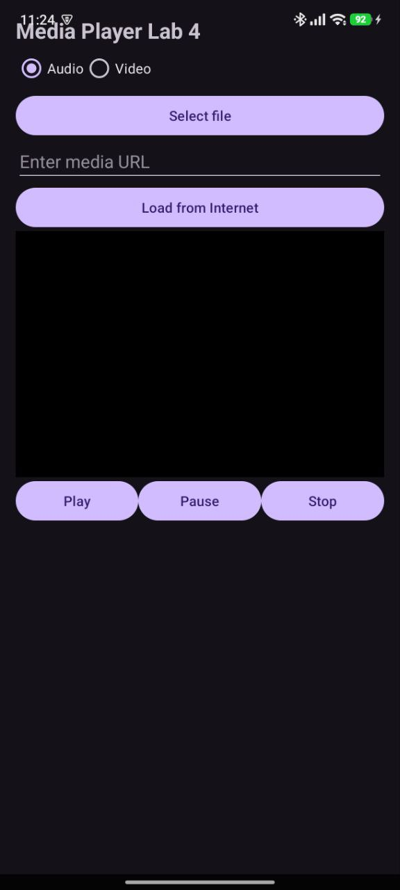
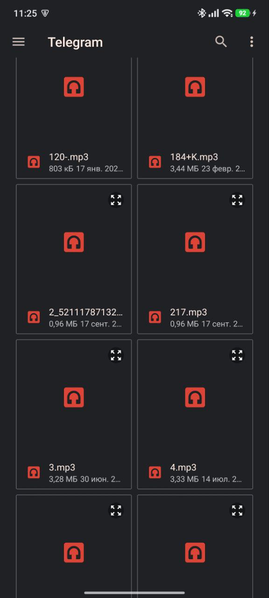
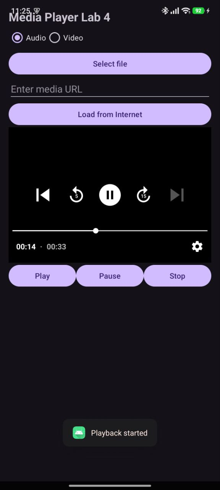
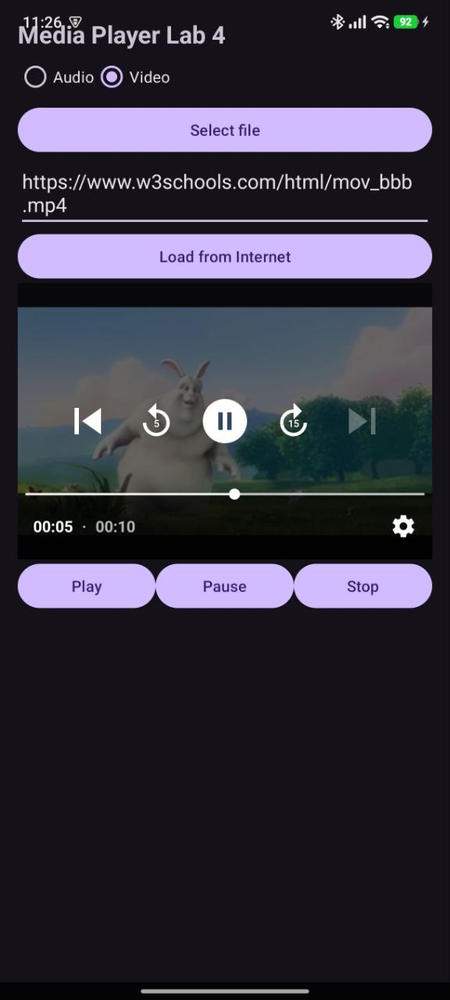

# Лабораторна робота №4  
## Дослідження способів роботи з медіаданими в Android

##  Студент

Група: ІП-35 
ПІБ:  Попов Владислав Олександрович
Дисципліна: Розробка мобільних застосунків  

---

# Мета роботи

Дослідити можливості платформи Android щодо роботи з медіаданими та отримати практичні навички використання інструментів для відтворення аудіо та відеофайлів.

---

# Опис застосунку

Було розроблено Android-застосунок для відтворення аудіо та відеофайлів.

Програма дозволяє:

- відтворювати аудіофайли
- відтворювати відеофайли
- відкривати файли з пам’яті телефону
- відтворювати медіа за URL з Інтернету
- керувати відтворенням

Для роботи з медіаданими використовується бібліотека **ExoPlayer (Media3)**.

---

# Використані технології

- Java
- Android Studio
- ExoPlayer (Media3)
- Android SDK
- PlayerView

---

# Інтерфейс програми

Інтерфейс програми складається з:

- перемикача типу файлу (Audio / Video)
- кнопки вибору файлу
- поля для введення URL
- кнопки завантаження медіа з Інтернету
- вікна програвача
- кнопок керування відтворенням

---

# Скріншоти

## Головний екран

---

## Вибір файлу

---

## Відтворення аудіо

---

## Відтворення відео

---

# Основні можливості програми

Реалізовані функції:

Відтворення аудіо  
Відтворення відео  
Пауза  
Зупинка  
Вибір файлу з пам’яті пристрою  
Завантаження медіа з Інтернету  

---

# Контрольні питання

## 1. Способи підключення Інтернет ресурсів до мобільного застосунку

Інтернет ресурси можуть підключатися до мобільного застосунку такими способами:

- HTTP/HTTPS запити
- використання REST API
- завантаження файлів з сервера
- потокове відтворення медіа
- робота з хмарними сервісами

У даній лабораторній роботі використовується відтворення медіафайлів за допомогою **URL-адреси з Інтернету**.

---

## 2. Різниця між внутрішнім та зовнішнім сховищем

**Внутрішнє сховище (Internal Storage)**  
- доступне тільки для одного застосунку  
- інші програми не можуть отримати доступ  
- файли видаляються разом із застосунком  

**Зовнішнє сховище (External Storage)**  
- доступне для інших застосунків  
- використовується для зберігання медіафайлів, документів, фото та відео  

---

## 3. Категорії файлів при збереженні в зовнішньому сховищі

Основні категорії файлів:

- Audio (музика)
- Video (відео)
- Images (зображення)
- Documents (документи)
- Downloads (завантажені файли)

---

## 4. Властивості інструментів для відтворення аудіофайлів

Інструменти для роботи з аудіо дозволяють:

- відтворювати аудіофайли
- ставити відтворення на паузу
- зупиняти відтворення
- перемотувати аудіо
- працювати з локальними файлами
- відтворювати аудіо з Інтернету

У сучасних Android застосунках часто використовується **ExoPlayer**.

---

## 5. Властивості інструментів для відтворення відеофайлів

Інструменти для відтворення відео забезпечують:

- програвання відеофайлів
- відображення відео на екрані
- керування відтворенням
- підтримку різних форматів відео
- можливість потокового відтворення

У даній лабораторній роботі використано **ExoPlayer + PlayerView**.

---

# Висновок

У ході виконання лабораторної роботи було досліджено способи роботи з медіаданими в Android.  
Було створено мобільний застосунок, який дозволяє відтворювати аудіо та відеофайли з пам’яті пристрою та з Інтернету.

Під час виконання роботи було отримано практичні навички використання бібліотеки **ExoPlayer** для роботи з медіаданими.
